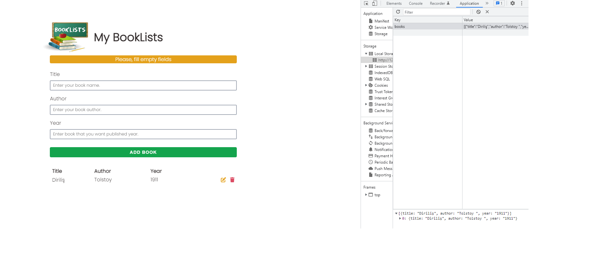

<h1>BookList OOP Project using vanilla JS</h1>

<ul>
<li>Sass</li>
<li>Google Fonts</li>
<li>OOP (ES6 Class)</li>
<li>CRUD(create, read, update, delete) operations</li>
<li>usage of static keyword in ES6 Class</li>
<li>Font Awesome</li>
<li>localStorage</li>
</ul>

was used by developing this project.

Also you can access live demo of <a href="https://fahriakbaba-mybooklists-oop-vanillajs.netlify.app/" target="_blank">this link</a>. by clicking this link.

